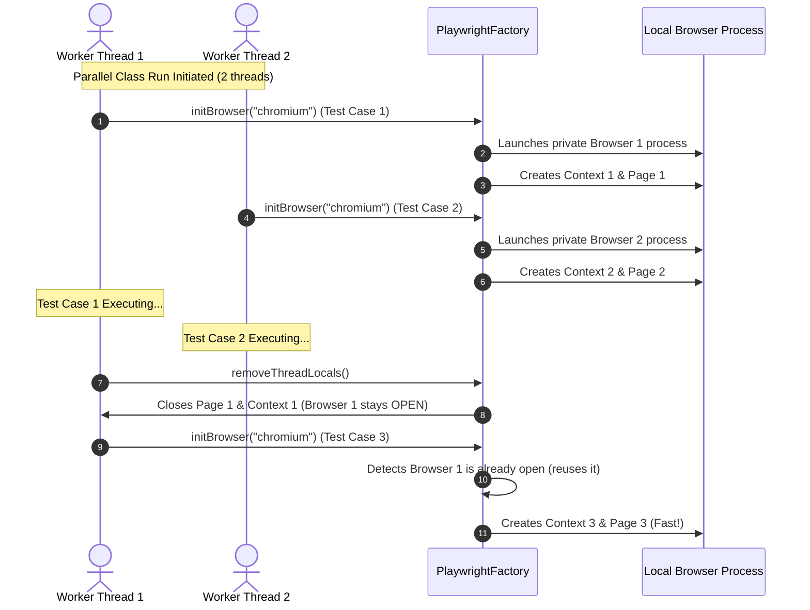

# Parabank Playwright Framework Architecture

This document maps out the key technical challenges encountered during the framework's development, the architectural decisions made to address them, and the resulting benefits.

## Problem - Decision - Result Matrix

| Category | Problem | Decision | Result |
| :--- | :--- | :--- | :--- |
| **Test Execution Speed** | Launching a new browser process (Chromium/Firefox) inside `@BeforeMethod` for every single test took 1.5–2.5 seconds per test, adding significant overhead to the execution suite. | Optimize the browser lifecycle. Cache the `Playwright` and `Browser` instances per thread in `ThreadLocal` storage, only spinning up a fresh `BrowserContext` (incognito window) and `Page` for each test method. | Browser processes are launched only once per thread. Creating a context takes milliseconds, maintaining 100% session isolation while saving over 90% of browser startup overhead. |
| **Parallel Execution Safety** | Sharing a single global static browser instance across parallel execution threads caused websocket connection collisions, resulting in crashes like: `Cannot find object to call __adopt__`. | Isolate Playwright and Browser instances per thread using `ThreadLocal<Playwright>` and `ThreadLocal<Browser>` in `PlaywrightFactory`. | Each thread has its own private, isolated browser engine. Tests run in parallel without connection collisions. |
| **AI Debugging Accuracy** | The AI engine (`llama3.2`) was fed ARIA accessibility tree snapshots which hid raw HTML attributes like `name="username"`, causing the AI to hallucinate generic user guides and wrong locators. | Swap the triage data source from ARIA tree snapshots to raw HTML page source (`page.content()`), and refine the system prompt to strictly enforce Playwright Java syntax rules. | The AI gained 100% visibility of technical attributes, allowing it to correctly identify missing or renamed attributes and suggest precise Playwright Java selectors. |
| **Flakiness Mitigation** | Tests occasionally failed due to transient environment delays, network glitches, or timing issues (flakiness), causing pipeline builds to fail. | Implement automated retries. Create a custom `RetryAnalyzer` and inject it globally to all `@Test` annotations at runtime using TestNG's `IAnnotationTransformer` listener. | Flaky tests are rerun up to 2 times. The first failed attempt is analyzed by the AI engine to log the flake root cause, while a successful rerun allows the build pipeline to pass. |
| **Thread-Safe Test Data** | Parallel test execution threads using shared/static random data generators (like Java Faker) risked generating duplicate registration data or overwriting active users mid-run. | Isolate runtime data models (like the generated `User` class) inside `ThreadLocal` wrappers in the Base class (`BaseUITestWithRegistration`). | Each test thread retains its own private, isolated user data, preventing cross-thread data contamination during parallel execution. |
| **Teardown Gracefulness** | If a test failed early (e.g., during browser bootup), the page object was null. The `@AfterMethod` teardown block would crash on `NullPointerException` trying to take snapshots, hiding the original failure. | Implement safety checks (`if (getPage() != null && !getPage().isClosed())`) before executing screenshot or HTML source captures in `BaseUITest`. | Teardown cleanups proceed gracefully. Only the original setup failure is reported in TestNG logs, and no secondary exceptions are thrown. |
| **Encapsulation & Environments** | Hardcoding the Ollama LLM endpoint URL (`http://localhost:11434/api/generate`) inside the code violated clean code practices and prevented running the triage engine on different hosts. | Extract the endpoint URL into the `config.properties` file (`ollamaApiUrl`) and fetch it dynamically via `ConfigurationManager`. | Clean separation of configuration and code. The AI server endpoint can be changed dynamically without compiling the codebase. |

---

## Architectural Lifecycle Diagram

The diagram below shows how a parallel thread reuses the browser instance while isolating the page contexts across test cases:

